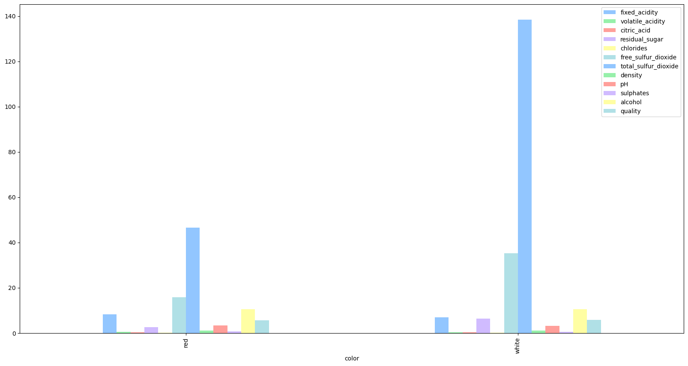

# INDE 577 *Data Science and Machine Learning*
This repository encompasses a graduate-level machine learning course designed to provide a comprehensive introduction to the field. It delves into essential algorithms, data science methodologies, and the complete data processing pipeline, offering a holistic approach to learning.

Machine learning is a branch of artificial intelligence that focuses on creating algorithms and models allowing computers to learn from data and make predictions or decisions without being explicitly programmed. This process involves techniques like supervised learning, unsupervised learning, and reinforcement learning. Machine learning finds applications in diverse domains such as image and speech recognition, natural language processing, healthcare, finance, and autonomous vehicles. By leveraging the power of data and algorithms, machine learning enables computers to automate tasks, uncover insights, and make intelligent decisions, revolutionizing problem-solving in the digital age. It involves developing techniques enabling computers to identify patterns and extract insights from large datasets, ultimately improving their performance over time through experience. In essence, machine learning enables computers to learn from examples and data, allowing them to tackle complex tasks and solve problems more effectively.

*It is often used for the following goals:*
- **Predictive analytics**: Machine learning algorithms are utilized to make predictions or forecasts based on historical data.
- **Pattern recognition**: Machine learning enables systems to identify patterns and structures in data, such as images, text, or signals.
- **Anomaly detection**: Machine learning models can detect unusual patterns or outliers in data that may signify potential problems or anomalies.
- **Optimization**: Machine learning algorithms are employed to optimize processes and systems by finding the best solutions based on predefined objectives.
- **Personalization**: Machine learning is used to personalize user experiences by recommending products, content, or services tailored to individual preferences.
- **Automation**: Machine learning facilitates automation of tasks and processes by learning from data and making decisions or taking actions autonomously.
- **Classification and clustering**: Machine learning techniques categorize data into groups or classes based on similarities or differences, aiding in organization and understanding of complex datasets.
Natural language processing: Machine learning algorithms enable computers to understand, interpret, and generate human language, powering applications like chatbots, language translation, and sentiment analysis.

## Course Description
Data Science & Machine Learning during the Spring 2024 semester at Rice University. Topics include the following:

- Data Science Foundations:
  - IDE's in Data Science
  - Version control with Git and GitHub
  - Data Exploration and Visualization
  - Python package management
    
- Supervised Learning:
  - Model Building, Validation, and Error Analysis
  - Gradient Descent
  - Linear and Logistic Regression
  - Neural Networks, and Support Vector Machines
  - k-Nearest Neighbors, Decision/Regression Trees, and Ensemble Learning

- Unsupervised Learning:
  - k-Means Clustering
  - Hierarchical Clustering
  - Principal Component Analysis
  - Anomaly Detection

Files in this repository are Jupyter Notebook projects demonstrating some of the machine learning algorithms covered in class and referenced in textbooks, particularly supervised learning algorithms and unsupervised learning algorithms.

Data Science tools used in this course:
- Python version 3.9 or higher
  - [pandas](https://pandas.pydata.org/docs/user_guide/index.html)
  - [Numpy](https://numpy.org/doc/stable/)
  - [Matplotlib](https://matplotlib.org/stable/contents.html)
  - [scikit-learn](https://scikit-learn.org/stable/user_guide.html)
  - [Tensorflow](https://www.tensorflow.org/api_docs/python/tf/all_symbols)

A brief visualization of supervised versus unsupervised learning: 

Topics List:
- [Supervised Learning](https://github.com/kjarjoura/INDE577demo/tree/main/Supervised%20Learning)
  - [Decision Trees](https://github.com/kjarjoura/INDE577demo/tree/main/Supervised%20Learning/Decision%20Trees)
  - [Ensemble Methods](https://github.com/kjarjoura/INDE577demo/tree/main/Supervised%20Learning/Ensemble%20Methods)
  - [Gradient Descent](https://github.com/kjarjoura/INDE577demo/tree/main/Supervised%20Learning/Gradient%20Descent)
  - [K Nearest Neighbors](https://github.com/kjarjoura/INDE577demo/tree/main/Supervised%20Learning/K%20Nearest%20Neighbors)
  - [Linear Regresssion](https://github.com/kjarjoura/INDE577demo/tree/main/Supervised%20Learning/Linear%20Regression)
  - [Logistic Regression](https://github.com/kjarjoura/INDE577demo/tree/main/Supervised%20Learning/Logistic%20Regression)
  - [Neural Networks](https://github.com/kjarjoura/INDE577demo/tree/main/Supervised%20Learning/Neural%20Networks)
  - [The Perceptron](https://github.com/kjarjoura/INDE577demo/tree/main/Supervised%20Learning/The%20Perceptron)
- [Unsupervised Learning](https://github.com/kjarjoura/INDE577demo/tree/main/Unsupervised%20Learning)
  - [DBSCAN](https://github.com/kjarjoura/INDE577demo/tree/main/Unsupervised%20Learning/Density-Based%20Clustering%20Non-Parametric%20Algorithm)
  - [K Means Clustering](https://github.com/kjarjoura/INDE577demo/tree/main/Unsupervised%20Learning/K%20Means%20Clustering)
  - [Principle Component Analysis](https://github.com/kjarjoura/INDE577demo/tree/main/Unsupervised%20Learning/Principle%20Component%20Analysis)

 
## Datasets
This project uses two primary datasets related to wine.

The first [dataset](https://archive.ics.uci.edu/dataset/186/wine+quality) is related to red and white vinho verde wine samples, from the north of Portugal. The goal is to model wine quality and color based on physicochemical tests. Chemical data includes: fixed acidity, volatile acidity, citric acid, residual sugar, chlorides, free sulfur dioxide, total sulfur dioxide, density, pH, sulphates, alcohol, quality. Visualization of means of chemical components for quality and color are below:

The second [dataset](https://archive.ics.uci.edu/dataset/109/wine) presents results of a chemical analysis of wines grown in the same region in Italy but derived from three different cultivars. The analysis determined the quantities of 13 constituents found in each of the three types of wines including alcohol, malic acid, ash, alcalinity of ash, magnesium, total phenols, flavanoids,
nonflavanoid phenols, proanthocyanins, color intensity, hue, OD280/OD315 of diluted wines, and proline. The goal is to model wine class (designated by one of three cultivars) based on these quantities. A visualization of means of components for class is below:

## Instructor
Randy R. Davila, PhD
- Adjunct Faculty
- Department of Computational and Applied Mathematics
- Email: rrd6@rice.edu
